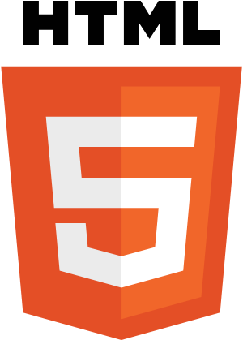
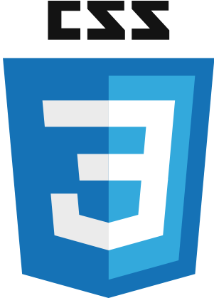
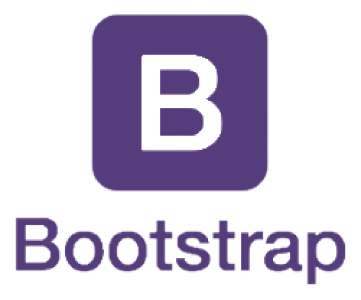
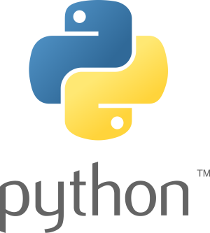
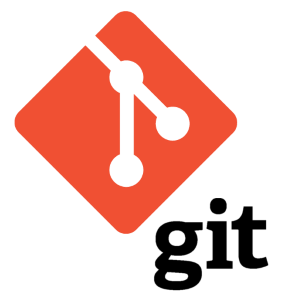
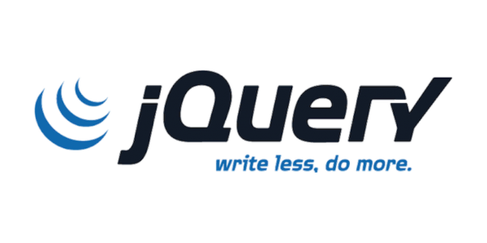
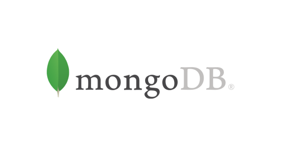

## Hi there, I'm Cecilia 👋

I recently completed a Diploma in Full Stack Software Development at the Code Institute and I hope you enjoy browsing through some of my recent projects. 

📫 How to reach me: [Linkedin](https://www.linkedin.com/in/cecilia-l-91b03919b/)
____

### My Toolbox

          

____

**Check out my latest projects below 👇🏾**